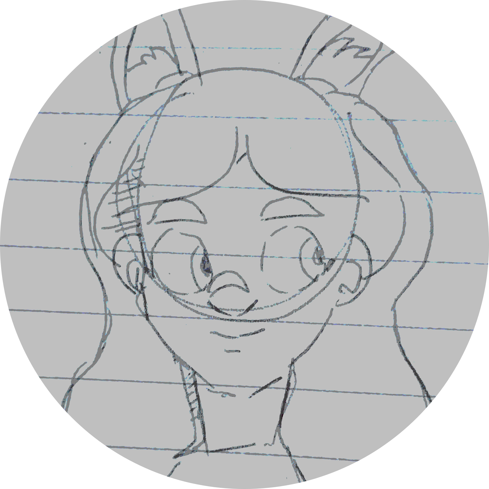

```bash
sabby@blue:~$ mommy hugo
```



Hi! I'm Sabby!! I like to draw as a hobby. I also advocate for the open source software that I use daily. I've used variations of Linux full-time for about 5 years now- that's a lot! My daily driver as of today is Fedora Workstation. I'm a long time GNOME fan. I like to use apps from Flathub when available. I use Krita to produce digital art (made by KDE). Please consider supporting these projects. [GNOME](https://www.gnome.org/donate/)/[KDE](https://kde.org/community/donations/)/[Software in the Public Interest](https://www.spi-inc.org/donations/)

I'm looking to submit my drawings here, and maybe write some opinion pieces.
Thanks for reading! Cheers!

PS: Special thanks to [blahaj.land](https://blahaj.land/) for hosting the site!
And be sure to check out [Zoey](https://zoey.blahaj.land/) and [the critter](https://crittercorner.space/)'s places as well! Cheers!


