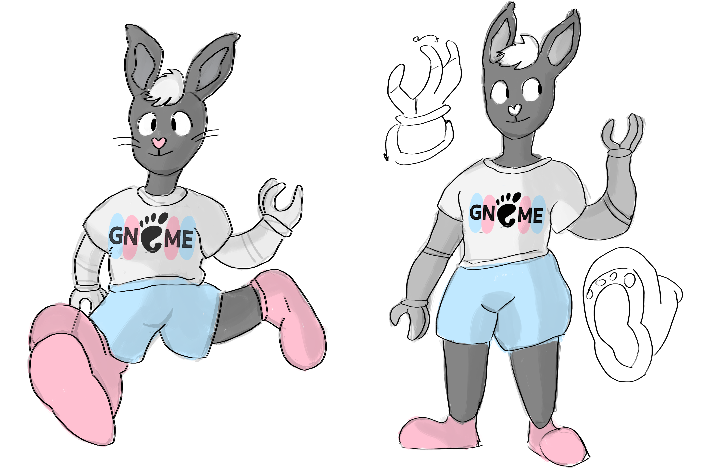

This is Grace the bunny! She loves to have fun, whether out and about playing sports or learning at school (and home!)
She's my mascot for the GNOME project.

Her design choices go as follows: 

- Grace is a child. GNOME Desktop is made to be simple and consistent so that young people will have an easier time using their computer, whether it be to learn or play. (GNOME Games)
- Grace is disabled! She wears prosthetic arms. Accessibility is at the core of GNOME's philosophy; that it may benefit every person.
- Grace is a girl. Women and girls are underrepresented in software development, and it's essential to allow us a voice and encourage more girls to be interested in the area.
- She's a rabbit! GNOME's long time icon is a small foot. And rabbits' feet are said to give good luck. I like that symbolism. The project is changing rapidly, and luck doesn't hurt.

Her name and appearance are not final. I've been thinking of some cool changes like longer hair, or even making her a jackalope to complement KDE's antlered dragon, Konqi.
