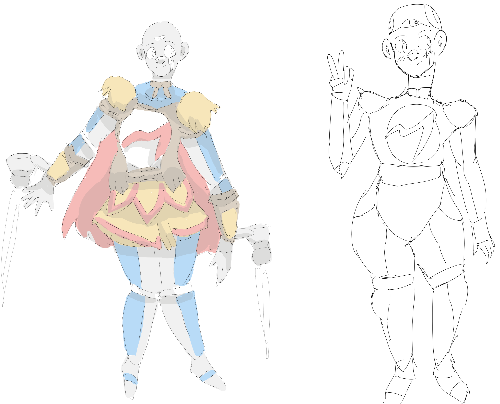

## Primus Machina

Primus is one of my most recent developments. It is said that she was a personal assistant bot who found herself flung onto a **time vortex** of unknown destination. She wound up in prehistoric Europe, where she will alter the timeline by teaching the nearby settlements about science and technology. It is believed she eventually assumes the role of king, or even god, revered for her advancements and role in the founding of the first civilization.

(She's so cute BTW!!)
 
 
